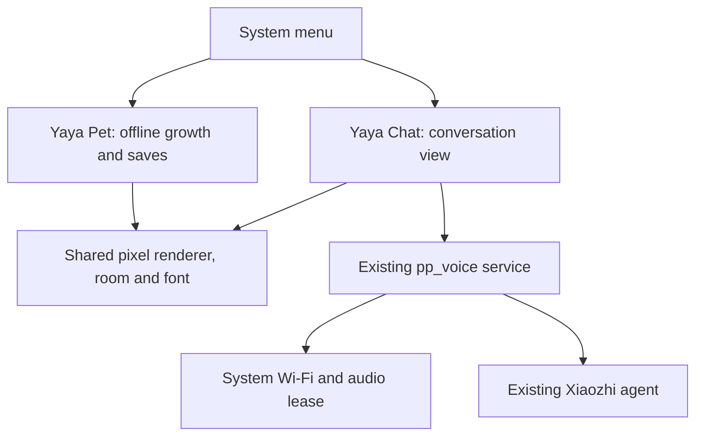

[简体中文](voice-integration.zh_CN.md) · **English**

# Independent care and conversation applications

The 0.6.0 product decision supersedes the earlier pet-data/voice integration plan. **Yaya Pet** remains an offline care game; **Yaya Chat** is the independent Xiaozhi application with a Yaya pixel appearance. The system menu switches between them. Existing Qixi cloud personality, voice and memory settings are unchanged.

## Ownership

There is no game-state connection between the applications. Chat does not load `app_pet`, read its model, change coins/XP or synchronize evolution. It never creates a second pet save. The pet's existing pause/checkpoint behavior applies when leaving it; chat does not advance that economy. The shared visual name does not alter the cloud role or imply the model knows local game state.

`pp_avatar_draw` supplies stateless original pixel drawing. `pp_avatar_view` owns one 96×88 I4 surface (4,288 bytes), including its palette. The old view is deleted and its image cache dropped before a new foreground view uses that surface. Both views use the same immutable room/font. No enlarged image, full-screen application buffer, separate animation task or pet-model dependency is added to chat.

UI calls run under the existing LVGL lock and use its render cadence. Voice workers never draw. Chat maps the existing `pp_voice_snapshot_t` state to listening/thinking/speaking; activation and diagnostic text remain visible. `pp_voice`, TLS, Opus, the 40 KiB worker and 0.5.3 automatic half-duplex behavior are unchanged in 0.6.0. See [voice controls and test boundaries](xiaozhi-standalone.md).

## Future extensions

IDA remains separate future work, not a call introduced by this firmware. Any later voice route needs explicit routing, cancellation, authoritative answer verification and credentials kept off the device. Shared artwork or audio does not grant permission to read pet saves or enterprise data. Revisit that scope explicitly rather than restoring the cancelled pet-data plan implicitly.

The [earlier research](xiaozhi-research.md) preserves source/protocol findings and historical proposals; it is not the current product roadmap. Community full BINs still replace the complete system, so future modules must follow the [catalog and combined-build workflow](app-integration.md).

## Resource and validation boundaries

The firmware keeps the 3 MiB program limit, `settings@0x310000`, `cardid@0x356000` and at least 512 KiB future-app Flash reserve. Bluetooth/NimBLE is disabled. Device Storage/About and diagnostic subpages are removed, while `capacity-report.json` continues to report the actual linked program and archives for development. Unassigned Flash is not installable app memory; linked static RAM excludes heap, stacks and DMA.

Verify actual LVGL rendering, exclusive sprite ownership, repeated two-way switches and byte-for-byte pet-save independence. A simulated voice snapshot proves appearance and UI ownership only. New 0.6.0 microphone/playback, memory minima, cancellation and dark-mode behavior require device acceptance; no new Device PASS or RAM-saving measurement is claimed here.
