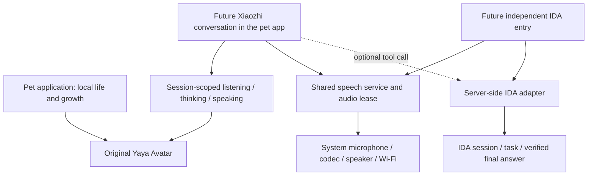

[简体中文](voice-integration.zh_CN.md) · **English**

# Pet, Xiaozhi and IDA integration boundary

Status: integration plan, not an implemented voice connection. The latest product decision is **the pet becomes Xiaozhi's Avatar; IDA retains a separate application entry and needs speech input/output**. Sharing a speech service does not require both entries to share a conversation, task history or permissions.

## One character, shared services, separate tasks

The pet remains useful offline. Its ID, level and form have one owner. Voice rendering can override its activity temporarily; game economics pause while talking, but the visual animation clock continues. Dialogue must not directly assign coins/XP or require payment/fullness to speak. The IDA entry can show its own task status instead of a second pet scene or duplicated Avatar assets.

`pp_avatar_begin/event/end` already defines local generation and turn checks. Interrupt/offline are terminal for that turn; stale speaking events are rejected. `pp_avatar_draw` is a stateless original pixel renderer. These are presentation contracts tested with simulated events, not a working network/audio stack. Future workers must queue bounded events to the control task; they must not invoke the renderer from sockets or audio callbacks.

## Xiaozhi adaptation

Reviewed source: [FoloToy fork at d24fce0](https://github.com/FoloToy/folo-ai-passport-xiaozhi/tree/d24fce080d86d7cc642f71585f6efde40fb99104), based on Xiaozhi 2.4.2, MIT with NOTICE. It targets the same ESP32-C3, 8 MiB Flash, no PSRAM, LCD and codec. The repository recommends IDF 6.0.2 and reports a 5.5.3 build; our actual combination must still be compiled with the pinned platform toolchain.

Adapt protocol and audio components into the pet's conversation mode; do not copy its `app_main`, display, keyboard, Wi-Fi provisioning, OTA or partition table. Its original full 8 MiB BIN replaces this platform and the OTA/resource layout crosses our protected ranges. The first integration should use button-controlled half-duplex, WebSocket and system Wi-Fi/audio. Local wake-word models, MQTT/UDP alternatives, bundled expression packs and OTA are deferred until measured Flash/RAM allow them. Yaya replaces the expression pack, with only one set of small character resources.

Bind visible states to actual events: recording started → listening; request submitted → thinking; audio playback actually started → speaking; playback drained/stopped → idle. Receiving text or a transport “done” event does not mean audio is playing or the business task succeeded. Stop and join workers before leaving the app; a stop flag alone is insufficient.

## IDA with speech

The existing project IDA client implements authentication, sessions, SSE task events, re-subscription, authoritative task/result lookup and cancellation. It is a Python/OS credential-store client, not ESP32 firmware and not proof of a speech interface. Prefer hosting/reusing its protocol logic in an authorized server-side adapter. Do not put a provider client secret, OS credential dependency or Python runtime in the BIN.

Two integration paths should be tested later:

1. **Preferred if supported by the selected Xiaozhi service:** let Xiaozhi handle listening/speaking and call a narrowly scoped IDA server tool. The standalone IDA entry selects an IDA task mode; pet chat may optionally use the same tool. This avoids maintaining a second full speech pipeline.
2. **Fallback:** a shared voice gateway provides ASR/TTS and routes text to IDA. Both app entries reuse the device microphone/playback service, while sessions and task IDs remain separate.

The fork's device-side MCP support does not establish that a particular cloud account offers custom IDA tools or standalone ASR/TTS APIs. First verify that capability, then run one small end-to-end speech → IDA → final answer → speech request before porting large dependencies. The gateway is a deployed service; normal device operation must not depend on an always-on personal computer.

IDA progress updates may drive a waiting indicator but are not spoken as the final answer. Reconnect reuses task/session IDs; replayed artifacts are deduplicated. Verify the authoritative task snapshot and the saved answer for that task, then enqueue TTS in bounded chunks. A transport HTTP 200, completed historical event or report reference alone is not content acceptance. An explicit user cancellation stops microphone/playback immediately and requests cancellation of the same remote task, with a bounded confirmation check; an unconfirmed cancellation must remain visibly unconfirmed.

## Capacity and runtime contract

There is one statically linked program, not three independently flashed BINs. Application entries and service providers share compiled libraries. Keep the existing 3 MiB app partition, 24 KiB settings at `0x310000` and identity at `0x356000`. Unassigned Flash cannot silently become executable space.

The current pet build reserves at least 1.25 MiB of program headroom. This is a gate, not a prediction of final Xiaozhi/IDA size. Measure the combined link after each voice milestone; count Wi-Fi, TLS, codec, common fonts and Avatar once. Keep audio queues bounded, release capture/playback buffers on stop, measure internal heap minimum and largest block, and test Wi-Fi/BLE/audio/display contention on the device. Runtime RAM can be the limiting resource even with ample Flash.

Do not add resources above protected identity while continuing to use a contiguous full BIN at `0x0`: padding would overwrite protected ranges. Any future resource partition requires its own reviewed segmented delivery flow.

## Later milestones

1. Accept this offline pet BIN and its persistence, screen modes, memory and visual behavior.
2. Integrate minimal Xiaozhi speech into the same pet, including actual recording, playback, cancellation, dark operation and stable app switching.
3. Validate an IDA speech route with a server adapter; add its independent entry, task status and cancellation behavior.
4. Add optional pet-to-IDA tool calling only after the child-facing task permissions and failure behavior are explicit.

No Xiaozhi or IDA protocol source, wake-word model, cloud credential, ASR/TTS service or remote task call is introduced by pet version 0.1.0. Reference: [current compatibility assessment](community-compatibility.md), [existing IDA client](../../../skills/ida-agent-client/references/api.md).
