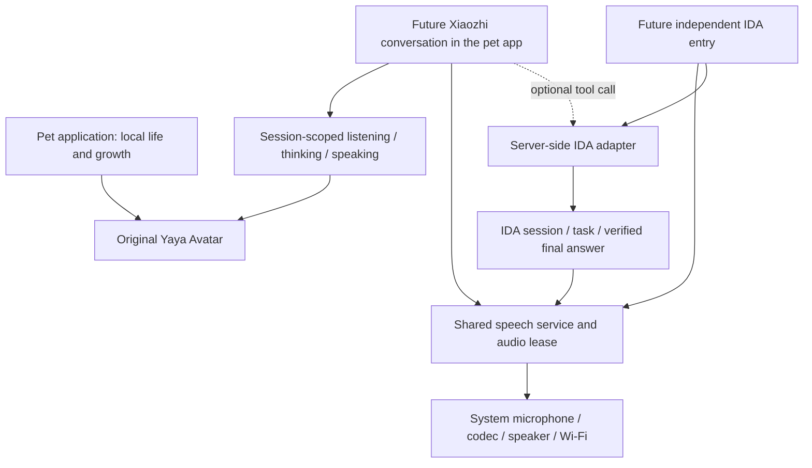

[简体中文](voice-integration.zh_CN.md) · **English**

# Pet, Xiaozhi and IDA integration boundary

Status: integration plan, not an implemented voice connection. Updated 2026-09-13: **a standalone Xiaozhi application and the pet chat mode share one voice service and the same configured cloud agent, personality, voice and memory settings**. The pet becomes its Avatar; IDA retains a future separate voice application. Cross-entry memory behavior requires a real service test; sharing audio does not share IDA privileges. The current evidence and implementation plan are in [Xiaozhi integration research](xiaozhi-research.md).

## One character, shared services, separate tasks

The pet remains useful offline. Its ID, level and form have one owner. Voice rendering can override its activity temporarily; game economics pause while talking, but the visual animation clock continues. Dialogue must not directly assign coins/XP or require payment/fullness to speak. The IDA entry can show its own task status instead of a second pet scene or duplicated Avatar assets.

`pp_avatar_begin/event/end` already defines local generation and turn checks. Interrupt/offline are terminal for that turn; stale speaking events are rejected. `pp_avatar_draw` is a stateless original pixel renderer. These are presentation contracts tested with simulated events, not a working network/audio stack. Future workers must queue bounded events to the control task; they must not invoke the renderer from sockets or audio callbacks.

## Xiaozhi adaptation

Reviewed source: [FoloToy fork at d24fce0](https://github.com/FoloToy/folo-ai-passport-xiaozhi/tree/d24fce080d86d7cc642f71585f6efde40fb99104), based on Xiaozhi 2.4.2, MIT with NOTICE. It targets the same ESP32-C3, 8 MiB Flash, no PSRAM, LCD and codec. The repository recommends IDF 6.0.2 and reports a 5.5.3 build; our actual combination must still be compiled with the pinned platform toolchain.

Current upstream 2.5.0 also supports the board as `ai-passport`, and the console can compile that standard source; it does not expose this project's custom source input. Adapt protocol/audio into one platform service used by both entries. Do not import `app_main`, display, keyboard, provisioning, firmware installation or partitions. Preserve configuration discovery/activation separately from OTA installation and store one identity in protected settings. Prefer button-initiated half-duplex and WebSocket only after real discovery confirms availability; upstream may supply/select MQTT instead. Defer wake-word models and bundled expression packs. Reuse Yaya and the system BSP. See the research for exact source revisions, parser bounds and measured-budget gates.

Bind visible states to actual events: recording started → listening; request submitted → thinking; audio playback actually started → speaking; playback drained/stopped → idle. Receiving text or a transport “done” event does not mean audio is playing or the business task succeeded. Stop and join workers before leaving the app; a stop flag alone is insufficient.

## IDA with speech

The existing project IDA client implements authentication, sessions, SSE task events, re-subscription, authoritative task/result lookup and cancellation. It is a Python/OS credential-store client, not ESP32 firmware and not proof of a speech interface. Prefer hosting/reusing its protocol logic in an authorized server-side adapter. Do not put a provider client secret, OS credential dependency or Python runtime in the BIN.

Two integration paths should be tested later:

1. **Preferred if supported by the selected Xiaozhi service:** let Xiaozhi handle listening/speaking and call a narrowly scoped IDA server tool. The standalone IDA entry selects an IDA task mode; pet chat may optionally use the same tool. This avoids maintaining a second full speech pipeline.
2. **Fallback:** a shared voice gateway provides ASR/TTS and routes text to IDA. Both app entries reuse the device microphone/playback service, while sessions and task IDs remain separate.

Device MCP and the cloud MCP endpoint are distinct. The official external-tool sample supports a future IDA server adapter, but neither a successful IDA voice round trip nor standalone ASR/TTS APIs have been verified. Model-selected tools also do not guarantee deterministic routing from an IDA app entry. Verify those boundaries and one speech → IDA → verified answer → speech request before adding dependencies; use a dedicated gateway if forced routing is unavailable. Normal device operation must not depend on an always-on personal computer.

IDA progress updates may drive a waiting indicator but are not spoken as the final answer. Reconnect reuses task/session IDs; replayed artifacts are deduplicated. Verify the authoritative task snapshot and the saved answer for that task, then enqueue TTS in bounded chunks. A transport HTTP 200, completed historical event or report reference alone is not content acceptance. An explicit user cancellation stops microphone/playback immediately and requests cancellation of the same remote task, with a bounded confirmation check; an unconfirmed cancellation must remain visibly unconfirmed.

## Capacity and runtime contract

There is one statically linked program, not three independently flashed BINs. Application entries and service providers share compiled libraries. Keep the existing 3 MiB app partition, 24 KiB settings at `0x310000` and identity at `0x356000`. Unassigned Flash cannot silently become executable space.

Platform 0.4.1 has 1,579,840 B of program headroom. The existing 1.25 MiB gate reserves future voice capacity during the offline-pet phase; voice implementation must explicitly account for consuming it, not silently disable the gate. This is not a prediction of final Xiaozhi/IDA size. Measure each combined link, counting shared components once. Bound queues, release buffers on stop, measure internal heap minimum/largest block and test Wi-Fi/BLE/audio/display contention. RAM can limit operation even with ample Flash.

Do not add resources above protected identity while continuing to use a contiguous full BIN at `0x0`: padding would overwrite protected ranges. Any future resource partition requires its own reviewed segmented delivery flow.

## Later milestones

1. Accept this offline pet BIN and its persistence, screen modes, memory and visual behavior.
2. Validate discovery and audio ownership, deliver standalone Xiaozhi, then connect the same service to the pet; verify recording, playback, cancellation, dark operation, switching and shared cloud memory.
3. Validate an IDA speech route with a server adapter; add its independent entry, task status and cancellation behavior.
4. Add optional pet-to-IDA tool calling only after the child-facing task permissions and failure behavior are explicit.

No Xiaozhi or IDA protocol source, wake-word model, cloud credential, ASR/TTS service or remote task call is introduced by pet version 0.1.0. Reference: [current compatibility assessment](community-compatibility.md), [existing IDA client](../../../skills/ida-agent-client/references/api.md).
