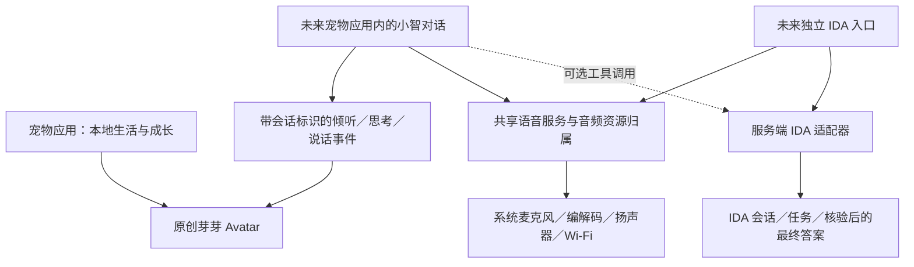

[English](voice-integration.md) · **简体中文**

# 宠物、小智与 IDA 的接入边界

状态：后续接入规划，尚未接通语音。最新产品决定是 **宠物成为小智的 Avatar；IDA 保留独立应用入口，并支持语音输入输出**。共用语音服务，不等于共用会话、任务历史或权限。

## 一个角色、共享服务、独立任务

宠物离线可用，身份、等级、形态只有一个维护者。对话期间，语音表现暂时覆盖日常动作，暂停游戏经济计时，画面动画时钟继续运行。对话不能直接赋值金币／经验，也不能要求宠物吃饱或付钱才能聊天。IDA 入口显示自己的任务状态，不必再复制一套宠物房间或角色素材。

本版 `pp_avatar_begin/event/end` 已定义本地代次和轮次校验；打断／离线会结束本轮，迟到的说话事件被拒绝。`pp_avatar_draw` 是无状态的原创像素绘制器。它们只通过模拟事件验证表现契约，还没有网络或音频闭环。以后工作任务通过有界队列通知控制任务，不能从 socket 或音频回调直接调用绘图。

## 小智如何整合

已研究源码：[FoloToy fork d24fce0](https://github.com/FoloToy/folo-ai-passport-xiaozhi/tree/d24fce080d86d7cc642f71585f6efde40fb99104)，基于小智 2.4.2，MIT + NOTICE。同款 ESP32-C3、8 MiB、无 PSRAM、屏幕与编解码器。仓库推荐 IDF 6.0.2，并报告 5.5.3 构建；我们仍需实际编译验证组合版本。

把协议、音频适配成宠物应用的对话模式，复用底座；不复制它的 `app_main`、显示、按键、Wi-Fi 配网、OTA 和分区表。原版 8 MiB BIN 会替换底座，其 OTA／资源布局穿过我们保护的数据区。第一步建议按键半双工、WebSocket、系统联网与音频；本地唤醒词、MQTT／UDP、多余表情包和 OTA 等有实测余量后再加。芽芽替代原表情包，只存一套小角色资源。

画面必须跟随真实事件：开始采集才倾听，请求已提交才思考，真正播放音频才说话，播放排空／停止后回待机。收到文字或传输完成不表示音频正在播，也不表示业务成功。离开应用前停止并等待工作任务退出，单纯设置停止标志不够。

## IDA 如何支持语音

现有项目 IDA 客户端已包含鉴权、会话、SSE 任务事件、重订阅、权威状态／答案回查和取消。它是 Python／系统凭据库客户端，不是 ESP32 固件，也不能据此推断有语音接口。优先在经授权部署的服务端适配器复用其协议逻辑，不把供应商 client secret、系统凭据库依赖或 Python 运行时装入 BIN。

后续验证两条路线：

1. **所选小智服务支持时优先采用**：小智负责听、说，通过权限收敛的服务端工具调用 IDA。独立 IDA 入口选择 IDA 任务模式；宠物聊天以后也可以选用同一工具。这样不用维护第二套完整语音链路。
2. **备选**：共享 Voice Gateway 提供 ASR／TTS，将文字路由给 IDA。两个入口复用设备录音和播放，会话、任务 ID 分开。

仓库支持设备端 MCP，不等于当前云端账号已经支持自定义 IDA 工具或独立 ASR／TTS API。要先核验能力，再用一条最小“语音 → IDA → 最终答案 → 语音”链路跑通，随后才引入较大的依赖。Gateway 是部署服务，设备日常使用不依赖个人电脑常开。

IDA 进度只能驱动等待提示，不当作最终答案朗读。重连复用 task／session ID，对重放内容去重；回查权威任务快照与该任务保存的答案，再以有界音频块进入 TTS 队列。HTTP 200、历史 completed 事件、报告引用都不足以代表内容验收。用户明确取消时立即停录音和播放，再取消同一远端任务并有界回查；未确认取消必须保持“尚未确认”的真实状态。

## 空间和运行约束

多个入口属于同一个静态链接程序，不是分别刷三个 BIN。公共库只编入一次。保留 3 MiB 程序分区、`0x310000` 的 24 KiB 设置和 `0x356000` 的设备身份；未分配 Flash 不能悄悄当成程序空间。

宠物构建至少预留 1.25 MiB 程序余量。这是门禁，不是对最终小智／IDA 大小的预测。每个语音里程碑后实际组合链接，Wi-Fi、TLS、codec、公共字体和 Avatar 只计一次。音频队列有界，退出释放录放缓冲，测内部 RAM 的最低可用量和最大连续块，并验证 Wi-Fi／BLE／音频／显示同时工作。即使 Flash 充足，也可能先遇到 RAM 限制。

不能在身份区之后加资源，却继续用从 `0x0` 连续写入的 full BIN：中间填充会覆盖保护区域。以后若新增资源分区，必须单独审查分段交付流程。

## 后续顺序

1. 先验收当前离线宠物的存档、熄屏、内存和画面。
2. 将最小小智语音接入同一只宠物，验证真实录音、播放、打断、黑屏与切应用。
3. 用服务端适配器验证 IDA 语音路线，再加独立入口、任务状态和取消。
4. 儿童可调用任务的权限、失败表现明确后，再开放宠物转调用 IDA。

宠物 0.1.0 没有引入小智／IDA 协议源码、唤醒词模型、云端凭据、ASR／TTS 服务或远端任务调用。参考：[兼容性评估](community-compatibility.zh_CN.md)、[已有 IDA 客户端](../../../skills/ida-agent-client/references/api.md)。
