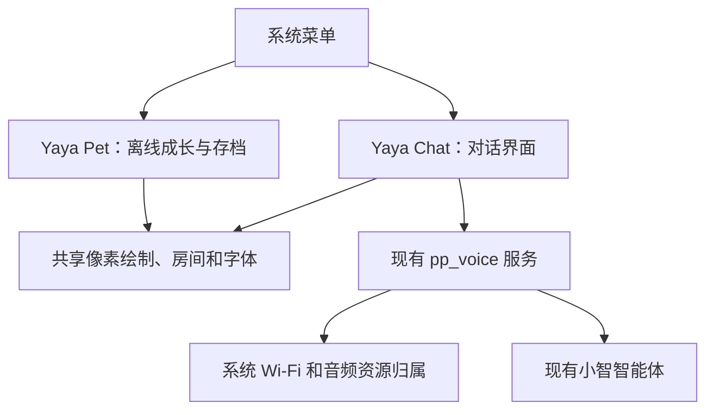

[English](voice-integration.md) · **简体中文**

# 独立养成与对话应用

0.6.0 的产品决定取代此前宠物数据与语音打通的计划。**Yaya Pet** 保持离线养成，**Yaya Chat** 是换上芽芽像素形象的独立小智应用，通过系统菜单切换。现有云端“七喜”的性格、声音与记忆设置不变。

## 资源与数据归属

两个应用没有游戏状态连接。聊天不加载 `app_pet`，不读取养成模型，不改变金币／经验，不同步进化，也不创建第二份宠物存档。离开养成时按原规则暂停和保存；聊天期间不推进其经济。共享外观和名字不会修改云端角色，也不代表模型知道本地成长状态。

`pp_avatar_draw` 提供无状态原创像素绘制，`pp_avatar_view` 只拥有一块 96×88 I4 缓冲，含调色板共 4,288 字节。先删除旧界面并丢弃图像缓存，新的前台界面才可复用。房间／字体同样共享，不给对话增加大图、全屏应用缓冲、独立动画任务或养成模型依赖。

UI 使用原 LVGL 锁和刷新节奏，语音线程不绘图。对话将现有 `pp_voice_snapshot_t` 映射为倾听／思考／说话，保留激活码和错误文本。0.6.0 不改 `pp_voice`、TLS、Opus、40 KiB 工作栈和 0.5.3 自动半双工行为；详见[语音操作及验证边界](xiaozhi-standalone.zh_CN.md)。

## 后续扩展

IDA 是后续独立工作，本固件不增加调用。未来语音路线仍需明确路由、取消、权威答案核验和设备外凭据管理；共享美术或声音不授予读取养成存档或企业数据的权限。需要时重新明确范围，不默认恢复已取消的宠物数据打通。

[历史研究](xiaozhi-research.zh_CN.md)保留源码／协议证据和当时方案，不代表当前产品路线。社区 full BIN 仍会替换整套系统；新模块按[清单与整包流程](app-integration.zh_CN.md)接入。

## 容量和验证边界

保留 3 MiB 程序上限、`settings@0x310000`、`cardid@0x356000` 和至少 512 KiB 后续应用 Flash 预留。关闭 Bluetooth／NimBLE，移除设备 Storage／About 和诊断子页，仍生成 `capacity-report.json` 供开发核对最终程序与归档。未分配 Flash 不是可安装应用内存；链接静态 RAM 不含堆、栈和 DMA。

验证真实 LVGL 绘制、角色缓冲独占、反复双向切换和宠物存档逐字节独立性。模拟语音快照只能证明画面和 UI 归属。0.6.0 麦克风／播放、最低内存、取消及黑屏行为须真机验收；本文不新增 Device PASS 或虚构 RAM 节省量。
