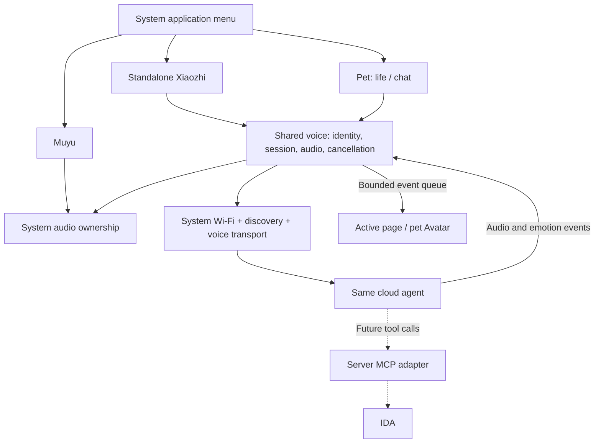

[简体中文](xiaozhi-research.zh_CN.md) · **English**

# AI Passport Xiaozhi integration research and implementation plan

Research date: 2026-09-13. Status: architecture and evidence review complete; voice integration is not implemented. Platform 0.4.1, commit `a1e8ed0feba9c3514d1a293ba621b88fed883153`, supplies the capacity and lifecycle baseline. Account configuration and private memories are excluded from this public report.

## 1. Decision and alternatives

Use **one platform firmware, one Xiaozhi voice service and two foreground entry points**. Add a standalone Xiaozhi application and a chat mode inside the pet; retain Muyu. Both voice entry points use the same configured cloud agent, personality, voice and memory settings. Only one foreground owner may capture, play or conduct a conversation at a time. IDA remains a future separate application.

This retains the platform keyboard provisioning, status bar, screen modes, persistence and application switching while avoiding duplicate codecs, protocol clients, fonts and expression assets. The Xiaozhi console manages the cloud agent; this repository builds and delivers the combined firmware. This is a design decision based on the existing constraints, not a demonstrated runtime result.

Standard Xiaozhi firmware supports this hardware, but its full image is not an installable platform application. The FoloToy port has a different startup entry and Flash layout. Extract and adapt selected code, then link it with the platform; do not concatenate two BINs.[^1][^4]

| Approach | Retains platform | Shared voice for both entries | Cost | Decision |
| --- | --- | --- | --- | --- |
| Console-built standard Xiaozhi | Not directly | Requires platform work | Easy standard image, replaces existing system | Reference device or standalone standard assistant |
| Make Xiaozhi the host and port all platform features back | Requires migration | Possible | Broad provisioning, persistence and lifecycle regression | Not selected |
| Embed a single adapted voice service into the platform | Yes | Yes | Adapter work; shared dependencies linked once | Preferred |
| Self-host a compatible voice gateway | Yes | Yes | Deployment, ASR/TTS and service operation | Fallback for unmet protocol or customization needs |
| Boot separate complete images from multiple partitions | No seamless switching | Runtime sharing is difficult | Reboot and protected-layout changes | Does not meet the product goal |

## 2. Current platform and source evidence

### Cloud compiler boundary

The console build dialog was inspected without submitting a job on 2026-09-13. It displayed version **2.5.0**, fixed source `ac6deed3d8e75348475364bf40ad953c6cd48054`, ESP32-C3 support and **FoloToy AI Passport**, with board ID `ai-passport`. It explicitly limited compilation to device firmware already merged into the public repository. Basic, display/camera and audio/provisioning tabs exposed no arbitrary repository, patch or multi-application project input. The dialog was cancelled.[^2]

The current console is therefore not the build entry for this project. Display-style and provisioning options do not imply support for compiling this project's sources. Reassess if custom-source builds become an explicit service capability; the existing GitHub CI remains the controlled build path today.

### Distinguish the two board ports

| Source | Pinned revision | Observed differences | Role |
| --- | --- | --- | --- |
| FoloToy dedicated fork | `d24fce080d86d7cc642f71585f6efde40fb99104`, 2026-08-23, based on 2.4.2 | `folo/ai-passport-c3`, type `folo-ai-passport-c3`; ESP wake word enabled; README reports battery API integration pending | Historical port and IDF 5.5.3 compatibility reference |
| Current console source | `ac6deed3d8e75348475364bf40ad953c6cd48054`, displayed version 2.5.0 | `folotoy/ai-passport`, type `ai-passport`; ESP wake word disabled in board config; CW2017 support | Current protocol, fixes and upstream board reference |
| This platform | 0.4.1 / `a1e8ed0` | Own menu, provisioning, protected partitions, small fonts and pet persistence | System receiving the integration |

The 2.5.0 release includes the Passport board and MCP validation changes. Do not attribute every older-fork limitation to current Xiaozhi. Equally, do not change the platform SDK, partitions, drivers and all dependencies merely to follow a new release. Pin source files and record adaptation reasons, retaining MIT licensing and NOTICE. The fork README recommendation, container default image and platform IDF 5.5.3 are not identical; a combined build remains a compatibility gate.[^1][^3][^5]

## 3. Three distinct connection paths

| Path | Direction and content | Integration role |
| --- | --- | --- |
| Configuration discovery / activation HTTP | Device identity and firmware information; activation and transport configuration response | Required adapter; do not remove it just because the class is named OTA |
| Device voice protocol | WebSocket or MQTT/UDP, Opus plus hello/listen/tts/stt/llm messages | Shared by standalone Xiaozhi and the pet |
| Cloud MCP endpoint | External tool adapter connects to the service for tool discovery and calls | Future IDA integration; not a microphone audio endpoint |

The device voice channel can also carry device MCP messages. The cloud is the MCP client and the device exposes tools. This differs from an external server connecting to the console's MCP endpoint. Read local pet state through a device tool; call remote IDA through a server adapter.[^6][^7][^8]

The maintainer's `mcp-calculator` sample supplies an external WebSocket pipe and stdio/SSE/HTTP tool adapters. It is a useful server-side starting point. Tool enumeration does not prove an account's IDA round trip, nor does it establish a standalone public ASR/TTS or forced-agent-routing API.[^8]

## 4. Binding, persistent identity and updates

The WebSocket implementation uses the physical MAC as `Device-Id`, a software UUID as `Client-Id`, and configuration-supplied authorization and protocol version. The UUID normally resides in default NVS. The two frontends must not generate separate identities, which would fragment binding and configuration.[^6][^9]

Recommended first-use sequence:

1. Connect through system Wi-Fi; neither application starts its own provisioning flow.
2. Load the shared identity and discover configuration in a cancellable worker.
3. Connect when binding and configuration are valid; otherwise display the returned activation code for association with the existing agent in the console.
4. Persist necessary identity/configuration once and reuse it from both entries. Application switching must not cause activation; only explicit credential or service changes should require it.

An existing cloud binding does not guarantee transparent migration. Previous full-image flashes may have erased the old UUID, and the service's binding behavior requires a real handshake. Try valid existing identity first, then use the normal activation flow when needed. Do not fabricate another device MAC or automatically unbind an existing device.

Default NVS at `0x9000` lies inside the contiguous full-image write range. Protected `settings` starts at `0x310000` and has 24 KiB. Store the shared Xiaozhi identity using `nvs_open_from_partition("settings", ...)` in a dedicated namespace, for example the proposed `svc_xiaozhi`, rather than copying default `nvs_open()`. Version and bound records, handle commit failures, and measure remaining NVS pages alongside Wi-Fi, system and pet records. Ordinary NVS is not encrypted storage.[^9][^10]

Keep transient session IDs, recordings and transcripts in memory. Existing cloud settings own long-term memory. Sharing an agent and identity supports the desired memory relationship, but **does not guarantee all short-term context survives each fresh WebSocket session or every utterance becomes long-term memory**. Verify cross-entry conversations on the service.

Separate configuration discovery from firmware installation. Upstream startup can install an offered update. The integrated service should parse activation and transport configuration while excluding upstream `firmware.url` installation, forced upgrades and arbitrary firmware-install tools. Report a truthful, stable board identity and distinct platform version, then test discovery compatibility. A GUI preference is not a substitute for this firmware boundary.[^11]

## 5. Shared service implementation boundary

Proposed layers are `pp_voice` for session state/ownership, `pp_xiaozhi` for discovery/protocol adaptation and `pp_app_xiaozhi` for the standalone UI. These names describe future components; they do not exist yet. The pet consumes the service instead of owning another protocol singleton. One BSP continues to drive ES8311, I2S and shared I2C.

| Area | Treatment | Reason |
| --- | --- | --- |
| hello/listen/abort/tts/stt/llm and Opus | Adapt pinned behavior with bounded messages | Compatible, testable protocol |
| Discovery and activation | Extract a small component | Binding without taking over updates |
| Device MCP | Small tool allowlist | Pet state without the whole device control surface |
| `app_main`, Application loop, Board singleton | Do not import wholesale | Platform already owns lifecycle |
| Provisioning, keys, screen, battery and volume | Reuse platform services | Avoid duplicate drivers/settings |
| Upstream partitions, OTA, assets download and themes | Exclude from first version | Protected layout and capacity |
| Audio workers | Start/stop through shared ownership | No recording or playback after switching |

The existing Muyu worker in `passport_audio.c` remains resident. Adding a second worker that also accesses BSP audio is insufficient. Introduce explicit audio ownership first, serialize format/capture/playback/volume changes, and acknowledge Muyu shutdown before voice begins. Reuse `bsp_audio_read()` and `bsp_audio_write()`, but verify cancellation deadlines and blocking I/O behavior.[^12]

Exit ordering: invalidate generation; reject new input/tool work; stop capture; best-effort abort and close the voice channel; clear queues and stop playback; wait for every worker acknowledgement; release audio ownership; delete the page. Preserve shared Wi-Fi while ending the old application's voice connection and tasks. Opening the system menu also cancels voice focus. Local cancellation does not erase cloud memory.

Upstream `AudioService::Stop()` sets flags, clears queues and notifies workers. Its return cannot alone prove every task has exited. The adaptation needs explicit joins or acknowledgements. Network/audio callbacks enqueue bounded events with generation and turn IDs; only the control task updates LVGL under its lock.[^13]

## 6. Interaction and pet behavior

The standalone page displays connection/listening/thinking/speaking states with the existing top status icons. Add a chat action to the pet's care selector and initially select it; feeding, playing and resting remain reachable with up/down. This avoids silently replacing the old OK action with recording and avoids conflicting with long OK for the system menu.

Start with **button initiation, half-duplex and one complete exchange**. A short press starts capture; prefer service-supported automatic endpointing, with an explicit manual stop path until endpointing is verified. A short press can end the turn or interrupt playback. Return to idle after playback rather than automatically listening forever. Button initiation does not require protocol `mode=manual`; test `auto` and `manual` separately. Defer wake words and simultaneous listening/speaking.

| Actual event | Visible state | Invalid shortcut |
| --- | --- | --- |
| Capture starts successfully | Listening | Assume a key press means recording works |
| Input is submitted | Thinking | Treat connection success as an answer |
| First PCM actually plays | Speaking and subtle mouth movement | Treat text or `tts.start` as audible playback |
| `llm.emotion` | Allowlisted expression mapping | Modify economy/system state from emotion text |
| Queue and device playback drain | Idle | Cut off buffered audio at `tts.stop` |
| Interrupt, focus loss or offline | Terminal turn, then idle/offline | Accept stale audio from the old generation |

Pause game economics while talking, retain animation time and resume without catch-up earnings. Hunger, currency or sleep must not gate conversation. Use the existing small procedural Avatar, not another character image set.

Speech and awareness of local pet state are separate acceptance steps. First establish the shared cloud character's real audio in the pet view. Then add a read-only `self.pet.get_state` returning name, level, form, activity and simplified status, plus necessary active-surface context. Verify that the model invokes the tool when needed; do not inject fabricated user speech every turn. Only the game model owns coins and XP.

An existing role does not automatically become a pet persona. If the selected cloud mode disables custom roles, retain that restriction and describe the device as the configured agent's pet Avatar. Tools must not bypass cloud role policies. When customization is actually available, configure consistent naming, short responses and child-readable language centrally. Device preferences cover volume, subtitles and screen behavior; personality, voice and long-term memory stay in the cloud.

Screen-off running keeps an active voice exchange but suspends drawing; screen-off paused cancels voice and releases audio. Existing pet input rejects invisible actions, so a chat button alone is insufficient. Service control must distinguish hidden display from lost focus: allow voice start/cancel while screen-off running and prevent invisible purchases. With no wake-word model, a key must still initiate voice in dark idle; long OK retains the system menu.[^14]

## 7. Protocol and audio checks

Source supports WebSocket versions 1/2/3. Common uplink settings are mono 16 kHz, 60 ms Opus; FoloToy board audio is configured at 24 kHz. Distinguish hardware capture rate, encoder input, server output and speaker rate. Never omit conversion while advertising another rate. Evaluate 16 kHz capture and compatible playback only with device verification.[^6][^15]

WebSocket is the preferred proposal, not a proven transport on this combined device. Upstream Application selects MQTT first when discovery supplies both. Source support does not establish that this device's discovery will supply usable WebSocket configuration. The first connectivity milestone must inspect actual transport availability. If only MQTT/UDP is supported, adapt that transport or use validated service configuration; do not guess addresses or include both stacks speculatively.[^11]

Test empty JSON, absent fields, negative/oversized lengths, fragmented messages, unsupported versions and short binary frames. Reviewed source directly interprets binary headers in some paths; the adapter must validate received length against header and payload length. Reputation of the source is not a bounds check. Bound queues by bytes and frames; queue exhaustion terminates the turn cleanly rather than accumulating indefinitely.[^6]

Keep TLS certificate validation. Log phases, sanitized error codes and timing, not authorization, raw discovery, activation challenges or audio. Use bounded retries with backoff and cancellation. Do not automatically replay previously submitted speech after disconnection because that can duplicate questions and actions.

## 8. Flash, RAM and subtitle budget

| 0.4.1 baseline | Bytes | Meaning |
| --- | ---: | --- |
| Physical Flash | 8,388,608 | Not executable capacity |
| Program partition | 3,145,728 | Hard 3 MiB limit |
| Current program image | 1,565,888 | Measured combined image |
| Program free | 1,579,840 | About 1.507 MiB |
| Pet exclusive Flash | 32,244 | Linked archive, not full firmware |
| Shared Avatar | 3,602 | Counted once |
| Pet static RAM | 4,429 | Excludes heap, stacks and DMA |

These are baseline build results, not measurements after Xiaozhi integration.[^16]

The existing `future_voice_reserve_min_bytes=1,310,720` gate reserves space during offline-pet development. Voice will consume that reserve; update its meaning through an explicit budget change rather than silently disabling it. A proposed study target retains 512 KiB after integration for fixes and a thin IDA frontend, leaving about **1,055,552 B** for new voice code/assets. This is neither a capacity guarantee nor a gate change made by this report. If exceeded, inspect the link map and trim scope before reconsidering the budget.

The C3 has no PSRAM. The reference non-audio-processor branch configures three audio task stacks totaling 30 KiB, before codec state, PCM, queues, TLS, Wi-Fi and display DMA. A 60 ms mono 16-bit PCM frame uses 1,920 B at 16 kHz or 2,880 B at 24 kHz. Compressed Opus packet size is not a complete RAM estimate.[^13]

Optimize by sharing codec/TLS once, excluding initial wake-word/AEC/large expressions/long prompts, bounding queue bytes and frames, allocating on demand, releasing on exit and reusing BSP/fonts. Do not record while idle. Test BLE/Wi-Fi/audio/display coexistence; do not quietly remove existing BLE behavior to pass a voice test.

The current subset font covers fixed UI, not arbitrary Chinese transcripts. The first audio milestone requires complete speech and fixed status, not a purported full transcript with missing glyphs. Later evaluate a bounded common-character font or dynamic glyph cache. The source Glyph Push extension requires correct font metadata and actual service support; enabling a flag is insufficient. Avoid importing a full assets partition or complete Chinese font initially.[^17]

Measure available/minimum internal heap, largest contiguous block, task stack high-water marks and queue peaks at boot, TLS handshake, capture, first playback, long replies, screen-off, menu and after 100 switches. Establish runtime thresholds after measuring codec/TLS peaks. Small static RAM is not evidence of runtime headroom.

## 9. Future IDA path

Prefer a later server bridge: device audio → Xiaozhi ASR/model → cloud MCP tool → IDA adapter → verified final result → Xiaozhi TTS → device. The server owns vendor credentials, task IDs, timeout/cancellation and result validation. Do not put IDA client secrets or Python in firmware. The adapter needs a continuously available deployment, not an always-on personal computer.[^8]

MCP tools are chosen by the model. They do not guarantee every utterance from a standalone IDA entry is forcibly routed to IDA. This review did not establish an official, verified per-entry forced-tool/agent API. Reuse this route for a standalone IDA application only after routing, long tasks and cancellation meet acceptance. Otherwise use the shared device audio service with a dedicated voice gateway for deterministic IDA routing.

Progress is not a final answer. Reconnect using the same task ID, deduplicate and verify results. Sharing a voice does not justify sharing all privileges between a child's pet and future enterprise-data tools. The first Xiaozhi milestone adds no IDA calls; it preserves adapter boundaries and capacity.

## 10. Staged implementation and acceptance

| Stage | Deliverable | Gate |
| --- | --- | --- |
| A: resource/connectivity spike | Shared audio ownership, identity, discovery, one real exchange | Binding to configured agent; actual transport confirmed; microphone signal; complete spoken answer; combined link and runtime heap fit |
| B: standalone Xiaozhi | Menu entry, key control, status, cancellation | Muyu/voice exclusivity; long menu stops audio; errors remain escapable; reflash preserves system settings and new identity |
| C: pet conversation | Shared service drives Avatar; chat action and read-only tools | Shared configuration and memory tested across entries; actual-event animations; unchanged economy; both screen modes |
| D: test package | Combined BIN, checksums, capacity and test records | Host tests, CI build, image boundaries; device matrix recorded; unperformed checks explicitly marked |
| E: later IDA | Server tool spike and routing decision | Verified IDA answer spoken; timeout, cancellation, privileges and standalone routing tested separately |

Host tests should cover identity corruption/full NVS, protocol fragments/malformed frames, negotiated parameters, full queues, cancellation generations, playback drain, stale callbacks, focus and dark-screen input. Retain existing Muyu/pet/capacity/image checks. Mocks provide failure coverage, not evidence of a live cloud connection.

The device matrix includes initial activation, existing binding, wrong Wi-Fi, silence, short/long input, weak network, interruption, menu during capture, repeated Muyu switches, pet-save recovery, both screen modes, dark input, BLE coexistence, 100 switches, 30 minutes of conversation and identity after reflash. Use permitted test facts for cross-entry memory without inspecting unrelated history; cloud memory omission is not automatically a local persistence defect.

## 11. Combined builds and maintenance

Start later implementation on `codex/*` from the accepted platform commit. Register the standalone app in the catalog; the pet links the shared service. Pin new dependencies and record licenses, then produce combined ELF/map and program/application attribution. Account for shared voice once as a shared component, not twice under both applications or hidden as unknown overhead.

Keep the 3 MiB program, settings and cardid layout. Assets beyond protected regions require a reviewed segmented flash procedure; contiguous padding from `0x0` would overwrite the intervening data. Use this project's CI for version/source/SDK/partition/SHA-256 and protected-range verification, producing the browser-flashable BIN. Standard cloud-built Xiaozhi is a reference artifact, not part of this release package.[^4][^10]

This research changes no runtime code, dependencies, partitions or cloud configuration. It submits no Xiaozhi-console build, deploys no MCP server and delivers no Xiaozhi-enabled BIN. Record document checks, CI regression builds of the existing platform and future voice-device tests separately; CI platform artifacts do not implement Xiaozhi.

## Sources

All sources were accessed or inspected on 2026-09-13. Moving source files are pinned where available. Console observations describe that day's UI, not an unpublished API contract.

[^1]: FoloToy, [AI Passport Xiaozhi port README](https://github.com/FoloToy/folo-ai-passport-xiaozhi/blob/d24fce080d86d7cc642f71585f6efde40fb99104/README.md), commit dated 2026-08-23; board config, LICENSE and NOTICE at the same revision were cross-checked.
[^2]: Xiaozhi, [Firmware compiler console](https://xiaozhi.me/console/firmware-builder), authenticated read-only inspection of three tabs and board options on 2026-09-13; no submitted job.
[^3]: 78, [Xiaozhi v2.5.0 release](https://github.com/78/xiaozhi-esp32/releases/tag/v2.5.0), published 2026-09-10 UTC; [board configuration](https://github.com/78/xiaozhi-esp32/blob/ac6deed3d8e75348475364bf40ad953c6cd48054/main/boards/folotoy/ai-passport/config.json) and [board README](https://github.com/78/xiaozhi-esp32/blob/ac6deed3d8e75348475364bf40ad953c6cd48054/main/boards/folotoy/ai-passport/README.md).
[^4]: FoloToy, [8 MiB partition layout](https://github.com/FoloToy/folo-ai-passport-xiaozhi/blob/d24fce080d86d7cc642f71585f6efde40fb99104/partitions/v2/8m.csv).
[^5]: FoloToy, [Firmware builder container](https://github.com/FoloToy/folo-ai-passport-xiaozhi/blob/d24fce080d86d7cc642f71585f6efde40fb99104/docker/firmware-builder/README.md) and [component dependencies](https://github.com/FoloToy/folo-ai-passport-xiaozhi/blob/d24fce080d86d7cc642f71585f6efde40fb99104/main/idf_component.yml). Container implementation is not proof of arbitrary-source SaaS support.
[^6]: 78, [WebSocket protocol](https://github.com/78/xiaozhi-esp32/blob/ac6deed3d8e75348475364bf40ad953c6cd48054/docs/websocket_zh.md) and [current implementation](https://github.com/78/xiaozhi-esp32/blob/ac6deed3d8e75348475364bf40ad953c6cd48054/main/protocols/websocket_protocol.cc); cross-checked against the FoloToy implementation.
[^7]: 78, [Device MCP interaction](https://github.com/78/xiaozhi-esp32/blob/main/docs/mcp-protocol.md); FoloToy, [device tools](https://github.com/FoloToy/folo-ai-passport-xiaozhi/blob/d24fce080d86d7cc642f71585f6efde40fb99104/main/mcp_server.cc). The protocol document itself requires code cross-checks.
[^8]: 78, [MCP sample README](https://github.com/78/mcp-calculator/blob/c537f71d61fd73b47d6c8955b5df6d3721acf4e4/README.md) and [WebSocket pipe](https://github.com/78/mcp-calculator/blob/c537f71d61fd73b47d6c8955b5df6d3721acf4e4/mcp_pipe.py), pinned commit dated 2026-02-28. Not deployed or called during this review.
[^9]: FoloToy, [Board UUID](https://github.com/FoloToy/folo-ai-passport-xiaozhi/blob/d24fce080d86d7cc642f71585f6efde40fb99104/main/boards/common/board.cc) and [default-NVS Settings](https://github.com/FoloToy/folo-ai-passport-xiaozhi/blob/d24fce080d86d7cc642f71585f6efde40fb99104/main/settings.cc).
[^10]: This project, [protected partitions](../partitions.csv) and [application integration](app-integration.md), baseline `a1e8ed0`.
[^11]: FoloToy, [discovery and activation](https://github.com/FoloToy/folo-ai-passport-xiaozhi/blob/d24fce080d86d7cc642f71585f6efde40fb99104/main/ota.cc) and [startup, updates and transport selection](https://github.com/FoloToy/folo-ai-passport-xiaozhi/blob/d24fce080d86d7cc642f71585f6efde40fb99104/main/application.cc).
[^12]: This project, [audio BSP](../components/bsp/src/bsp_audio.c) and [Muyu worker](../main/passport_audio.c), baseline `a1e8ed0`.
[^13]: FoloToy, [audio workers](https://github.com/FoloToy/folo-ai-passport-xiaozhi/blob/d24fce080d86d7cc642f71585f6efde40fb99104/main/audio/audio_service.cc) and [queue configuration](https://github.com/FoloToy/folo-ai-passport-xiaozhi/blob/d24fce080d86d7cc642f71585f6efde40fb99104/main/audio/audio_service.h).
[^14]: This project, [application lifecycle](../main/passport_apps.h), [screen state](../main/passport_screen.c) and [pet controller](../components/pp_app_pet/pp_pet_app.c), baseline `a1e8ed0`.
[^15]: FoloToy, [audio rates and pins](https://github.com/FoloToy/folo-ai-passport-xiaozhi/blob/d24fce080d86d7cc642f71585f6efde40fb99104/main/boards/folo/ai-passport-c3/config.h).
[^16]: This project, [0.4.1 CI](https://github.com/xibumianbao/ai-passport/actions/runs/34739346185), artifact `capacity-report.json`, and [capacity generator](../tools/build_capacity.py). Figures exclude unimplemented Xiaozhi integration.
[^17]: FoloToy, [dynamic Glyph Push extension](https://github.com/FoloToy/folo-ai-passport-xiaozhi/blob/d24fce080d86d7cc642f71585f6efde40fb99104/docs/glyph-push_zh.md).
