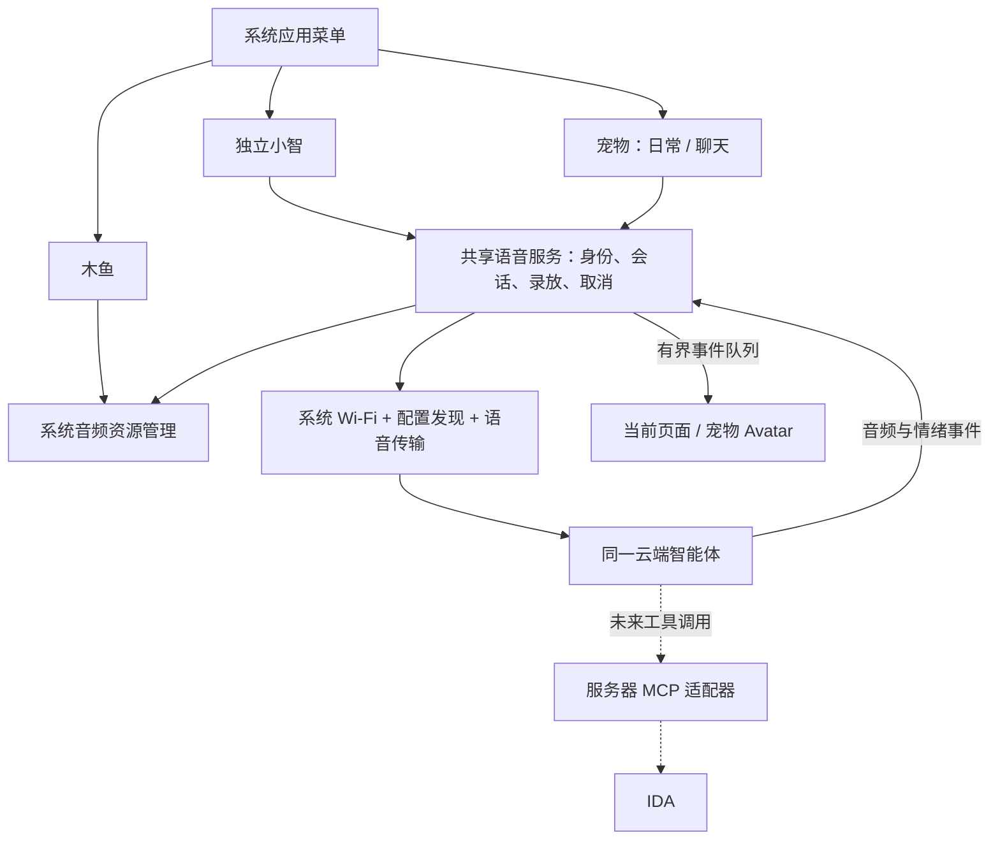

[English](xiaozhi-research.md) · **简体中文**

# AI Passport 小智融合研究与实施方案

研究日期：2026-09-13。状态：架构方案与证据核验完成，语音功能尚未实现。本报告以底座 0.4.1、提交 `a1e8ed0feba9c3514d1a293ba621b88fed883153` 为容量和生命周期基线。账号配置与私人记忆不收录在公开报告中。

## 1. 结论与选择

采用**一个平台固件、一个小智语音服务、两个前台入口**：应用菜单增加独立“小智”，宠物增加“聊天”模式，木鱼保留。小智与宠物复用同一已配置的云端智能体、人格、声音和记忆配置；设备同一时间只有一个录音／播放和对话拥有者。IDA 保留后续独立应用方向。

这能同时保留底座的按键配网、顶部状态栏、熄屏模式、存档和应用切换，也避免复制两份 codec、网络协议、字体和表情资源。小智控制台负责云端智能体配置，我们的仓库负责组合固件和交付。该架构是结合现有代码约束得出的设计选择，并非已经完成的运行结果。

标准小智固件已经支持这块硬件，但标准整包不是可安装进底座的子应用。FoloToy 适配仓库与现有平台的启动入口和 Flash 布局不同；其代码需要提取、适配、重新链接，不能拼接两个 BIN。[^1][^4]

| 方案 | 保留现有平台 | 两个入口共用语音 | 维护与容量代价 | 判断 |
| --- | --- | --- | --- | --- |
| 控制台编译标准小智整包 | 不能直接保留 | 需重新开发平台 | 上手快，但会替换原系统 | 适合独立标准小智设备／对照样机 |
| 小智作为主系统，再搬回木鱼和宠物 | 需迁移全部平台生命周期 | 能做 | 重做配网、持久化、菜单，回归面大 | 当前不选 |
| 现有底座内嵌一份小智协议与语音服务 | 保留 | 支持 | 需实现适配层，公共库只链接一次 | 首选 |
| 本地或云端自建兼容语音网关 | 保留 | 支持 | 增加部署、ASR/TTS 和运营责任 | 服务协议或定制能力不满足时备用 |
| 多分区分别启动两个完整固件 | 不能无缝切换 | 难以复用运行状态 | 要重启且改变受保护布局 | 不符合当前产品目标 |

## 2. 最新平台和源码证据

### 云端编译的实际边界

2026-09-13 只读检查控制台“创建编译”弹窗：版本为 **2.5.0**，源码固定为 `ac6deed3d8e75348475364bf40ad953c6cd48054`；芯片 ESP32-C3 的板型列表含 **FoloToy AI Passport**，开发板 ID 为 `ai-passport`。页面说明目前只支持已合并到 GitHub 开源仓库中的设备固件。已检查基础、显示与摄像头、音频与配网三个页签，没有发现导入任意仓库、补丁或自定义多应用项目的入口。检查后取消，未提交编译。[^2]

因此，当前控制台不是本项目的构建入口。即使标准固件可以选择显示风格和配网方式，也不能据此推断能编入本项目代码。以后若服务明确开放自定义源码构建，可重新评估；截至本次核验，继续使用现有 GitHub CI 更可控。

### 两套硬件适配需要区分

| 来源 | 固定版本 | 观察到的差异 | 用途 |
| --- | --- | --- | --- |
| FoloToy 专用仓库 | `d24fce080d86d7cc642f71585f6efde40fb99104`，2026-08-23，基于 2.4.2 | 板目录 `folo/ai-passport-c3`，标识 `folo-ai-passport-c3`；启用 ESP wake word；README 中电量接口尚未接入 | 历史硬件适配、IDF 5.5.3 兼容参考 |
| 小智当前控制台源码 | `ac6deed3d8e75348475364bf40ad953c6cd48054`，页面版本 2.5.0 | 板目录 `folotoy/ai-passport`，标识 `ai-passport`；配置关闭 ESP wake word；带 CW2017 电量支持 | 当前协议、上游修复和板卡支持交叉参考 |
| 本项目底座 | 0.4.1 / `a1e8ed0` | 自有菜单、配网、保护分区、小字体、宠物存档 | 实际被集成的系统 |

上游 2.5.0 发布记录包含 AI Passport 板卡支持和 MCP 参数校验等变化。不能把旧 fork 的限制一概描述成小智当前限制，也不能为了跟随新版本而同时更换底座 SDK、分区、驱动和所有依赖。移植应固定来源提交，记录每个引入文件与修改理由，保留 MIT 许可证与 NOTICE。FoloToy README 的 IDF 推荐、容器默认镜像和本项目 IDF 5.5.3 并不完全相同，组合编译是兼容性验收的一部分。[^1][^3][^5]

## 3. 三条连接通道各自负责什么

| 通道 | 方向和内容 | 与本项目关系 |
| --- | --- | --- |
| 配置发现／激活 HTTP | 设备发送身份及固件信息，服务返回激活状态和传输配置 | 必须适配；不能因接口叫 OTA 就全部删除 |
| 小智设备语音协议 | WebSocket 或 MQTT/UDP；Opus 音频与 hello、listen、tts、stt、llm 等消息 | 本次核心；独立小智与宠物共用 |
| 云端 MCP 接入点 | 外部工具适配器连接平台，交换工具发现和调用消息 | 未来接 IDA 等服务；不是设备麦克风的音频地址 |

设备语音连接内还可以携带 `type=mcp` 的设备工具消息，云端是 MCP 客户端，设备是工具服务端。它与“外部服务器连到控制台的 MCP 接入点”用途不同。宠物本地状态适合通过设备工具读取；远端 IDA 适合通过服务器上的工具适配器调用。[^6][^7][^8]

官方维护者的 `mcp-calculator` 示例已提供外部 WebSocket 管道和 stdio／SSE／HTTP 工具适配方式，可作为未来服务器桥接起点。但示例能列工具不等于本账号已完成 IDA 端到端验证，更不意味着小智公开了独立 ASR、TTS 或强制切换 Agent 的 API。[^8]

## 4. 首次绑定、身份保存与更新

上游 WebSocket 实现使用硬件 MAC 作为 `Device-Id`、软件 UUID 作为 `Client-Id`，并按下发配置携带连接令牌和协议版本。UUID 默认保存在普通 NVS 中。两个前台入口不能各自生成身份；否则同一硬件会产生额外绑定和配置分叉。[^6][^9]

建议首次流程如下：

1. 在系统 Wi-Fi 中连接网络；独立小智与宠物都不另开热点或重复配网。
2. 语音服务加载一份设备身份，在工作任务中执行配置发现；UI 保持可退出。
3. 已绑定且配置有效时连接服务；否则显示真实返回的激活码和简短提示，家长在控制台把设备关联到现有智能体。
4. 保存身份及必要连接配置，两个入口立即复用。只有凭据失效、服务迁移等明确原因才重新激活，不因切应用重新绑定。

当前已存在的云端绑定不等于新底座能够无条件继承：旧 UUID 可能随此前整包重刷而丢失，云端实际的绑定判断也需要真实握手核验。首次融合固件可以先尝试现有身份；需要重新激活时走平台正式流程，不伪造其它设备 MAC，也不自动解绑旧设备。

本项目普通 NVS 位于 `0x9000`，处在 full BIN 连续覆盖范围内；受保护的 `settings` 在 `0x310000`，大小 24 KiB。小智持久身份应通过 `nvs_open_from_partition("settings", ...)` 进入专用命名空间（例如 `svc_xiaozhi`，名字为提案），不要照搬默认 `nvs_open()`。保存格式需要版本和长度限制、提交错误处理，并检验与现有 Wi-Fi／平台设置／宠物存档共存时的 NVS 剩余页数。普通 NVS 不能被描述为加密存储。[^9][^10]

短期会话 ID、录音和逐字聊天记录只放内存；云端长期记忆由既有智能体设置管理。共用智能体和身份是共用记忆的必要设计条件，**不保证服务会跨每次新建 WebSocket 会话保留全部短期上下文，也不保证任意一句话都会进入长期记忆**。必须用跨入口对话实测。

配置发现和安装固件必须拆开。上游启动逻辑可在发现新版本后执行升级；融合版保留激活／配置响应解析，但不执行上游 `firmware.url` 下载、`force` 升级或远端任意固件安装工具。平台自身的版本号与板型上报应真实、稳定，并通过配置发现验证兼容性；本地 GUI 设置不能替代固件级升级边界。[^11]

## 5. 共享语音服务的实现边界

建议分成 `pp_voice`（会话状态与所有权）、`pp_xiaozhi`（配置与协议适配）、`pp_app_xiaozhi`（独立页面）三层；名字为设计提案，目前不存在这些实现。宠物调用服务，不能拥有第二套协议单例。底层录放仍由 BSP 驱动同一 ES8311、I2S 和共享 I2C。

| 内容 | 处理方式 | 原因 |
| --- | --- | --- |
| 小智 hello／listen／abort／tts／stt／llm 语义、Opus | 参考固定源码适配，限制消息大小 | 保持服务兼容与可测协议边界 |
| 激活／配置发现 | 拆出小组件 | 保留绑定，不接管固件更新 |
| 设备 MCP | 少量白名单工具 | 让云端读取宠物状态，不暴露完整设备控制面 |
| `app_main`、Application 总循环、Board 单例 | 不直接并入 | 本平台已有生命周期所有者 |
| Wi-Fi 配网、按键、显示、电量、音量设置 | 复用底座 | 避免双重驱动和配置分叉 |
| 原版分区、OTA、assets 下载、主题资源 | 不引入初版 | 保护布局和程序预算 |
| 音频工作任务 | 共享服务按需启停 | 应用切换后不能残留录音或播放 |

现有 `passport_audio.c` 的木鱼 worker 在后台长期存在，不能简单让新语音 worker 也直接读写 BSP。移植需要先增加明确的音频租约／所有者，串行切换采样率、录音、播放和音量；退出木鱼的确认必须在语音启动之前完成。已有 `bsp_audio_read()`、`bsp_audio_write()` 可以复用，但取消时限和阻塞 I/O 行为还需专项验证。[^12]

退出顺序应为：撤销本地代次 → 停止接受新按键／工具请求 → 停采集 → 尽力发送 abort 并关闭语音通道 → 清队列并停止播放 → 等待所有 worker 确认退出 → 释放音频所有权 → 删除页面。共享 Wi-Fi 保留，旧应用语音连接和任务结束。系统菜单同样触发语音失焦取消，不能一边选应用一边继续录音。旧云端记忆不因本地取消而删除。

上游 `AudioService::Stop()` 中有停止标志、清队列和通知动作，但不能把调用返回直接当成全部工作任务已退出的证明。组合实现需要自己的 join／确认机制。网络与音频回调只提交带 `generation`／`turn_id` 的有界事件，LVGL 操作在控制任务并持锁进行。[^13]

## 6. 语音交互与宠物表现

独立“小智”页面显示固定的连接／倾听／思考／说话状态，沿用顶部 Wi-Fi、BLE、电量图标。宠物在现有照顾动作中增加“聊天”入口，首次进入后默认选中聊天；喂食、陪玩、休息仍能用上下键选择。此设计避免把原有 OK 喂食动作悄悄变成录音，也避免与长按 OK 打开系统菜单冲突。

初版优先**按键启动、半双工、一次完整对话**：短按开始，优先用服务支持的自动断句结束输入；短按可结束本轮或打断播放。自动断句未经实测前保留明确的手动结束输入路径。播放结束后回到待机，不默认无限重新监听。按键启动不等于必须使用协议 `mode=manual`；`auto` 与 `manual` 的行为必须分别验证。唤醒词与边听边说稍后再评估。

| 实际事件 | 页面／Avatar 状态 | 禁止的捷径 |
| --- | --- | --- |
| 麦克风成功启动 | 倾听 | 点击按钮立即假装已经录到音 |
| 本轮输入已提交 | 思考 | 仅连接成功就显示正在回答 |
| 首块 PCM 实际进入播放 | 说话、轻微嘴部动作 | 收到文字或 `tts.start` 就认为已发声 |
| `llm.emotion` 到达 | 白名单映射的表情 | 用情绪文本修改金币、经验或系统状态 |
| 音频队列和设备播放排空 | 待机 | 收到 `tts.stop` 就截断尚未播完的尾音 |
| 用户打断／失焦／离线 | 中断或离线后待机 | 接受旧代次的迟到音频 |

对话期间暂停游戏经济计时，保留动画时钟，结束后恢复日常状态，不补算对话期间的打工收益。低饱食、没金币或睡觉不应成为聊天门槛。初版无需另一套人物图片；使用现有程序生成的小像素 Avatar。

“会说话”与“了解本地宠物状态”分两步验收。最小语音闭环先让同一云端角色在宠物画面上听说；第二步增加只读 `self.pet.get_state`，返回宠物名字、等级、形态、当前活动及简化状态，再增加必要的当前入口信息。模型是否主动调用工具需要实测，不能靠每轮伪造一段用户语音注入状态。金币／经验只由游戏模型维护。

原角色人设不一定自动变成宠物人设。若所选云端模式禁用自定义角色，应保留平台限制，明确呈现为“现有智能体的宠物 Avatar”；工具不能作为绕过云端角色策略的手段。日后平台允许定制时，再设置一致的宠物名字、短回答和儿童易懂表达。角色、声音和长期记忆在云端统一配置，设备仅设置音量、字幕和熄屏偏好。

熄屏运行模式保持主动会话的声音、暂停页面绘制；熄屏暂停模式应中止会话并释放录放。现有宠物按键逻辑拒绝不可见时的操作，所以不能只给 UI 加一个聊天按钮：服务控制需区分“未显示”与“已失焦”，让熄屏运行仍可开始／取消语音，同时禁止黑屏误触购买。没有自动唤醒时，黑屏待机按键仍应能启动语音；长按继续进入系统菜单。[^14]

## 7. 协议与音频的关键核验点

源码支持 WebSocket 协议版本 1／2／3，上行常见参数为单声道、16 kHz、60 ms Opus；FoloToy 板级音频配置为 24 kHz。必须区分麦克风硬件速率、编码输入速率、服务下行速率和扬声器速率，不能省略重采样后仍按错误速率播放。可以评估统一 16 kHz 录音和与下行匹配的播放，但需要实际设备确认。[^6][^15]

WebSocket 是首选传输提案，尚未通过这台融合固件验证。上游 Application 在同时收到 MQTT 和 WebSocket 配置时优先选 MQTT；因此不能从“源码支持 WS”推断“本设备配置发现一定下发可用 WS”。第一个连通里程碑必须检查服务返回的传输选项。若只有 MQTT/UDP，则实现被支持的传输适配器或使用经过验证的服务配置；不猜测地址、硬编码他人令牌，也不同时引入两套传输碰运气。[^11]

解析器必须覆盖空 JSON、缺字段、负数／超大长度、WebSocket 分片、版本不匹配和短二进制帧。所核对源码在二进制分支存在直接按头结构解释 payload 的路径；组合实现应显式验证完整帧长度与头内长度，不能仅凭来源知名就跳过边界检查。发送队列满时中止当前轮并提示，不能无限累积；下行限制单帧、总缓冲字节及等待时间。[^6]

TLS 保留证书校验。连接日志只记阶段、脱敏错误码和耗时，不输出 Bearer、完整发现响应、激活挑战或音频。连接重试带退避、总超时和用户取消；断线后不自动重发整段已提交语音，以免重复提问／重复工具动作。

## 8. Flash、内存与字幕预算

| 0.4.1 构建基线 | 大小 | 含义 |
| --- | ---: | --- |
| 物理 Flash | 8,388,608 B | 不等于程序可用空间 |
| 程序分区 | 3,145,728 B | 当前硬上限 3 MiB |
| 已用程序镜像 | 1,565,888 B | 真实组合镜像 |
| 程序剩余 | 1,579,840 B | 约 1.507 MiB |
| 宠物独占 Flash | 32,244 B | 已链接宠物归档；不是完整程序 |
| 公共 Avatar | 3,602 B | 只计一次 |
| 宠物静态 RAM | 4,429 B | 不含系统堆、栈、DMA |

数据来自本项目 0.4.1 容量报告和构建链路，不能当作引入小智后的测量。[^16]

当前 `future_voice_reserve_min_bytes=1,310,720` 是离线宠物阶段为语音预留的门禁。语音实现会实际消耗这部分预留；届时需通过明确的预算变更更新门禁语义，不能静默关闭检查。建议研究性目标是融合后再留 512 KiB 给修复与 IDA 薄入口：对应本次新增代码和资源约 **1,055,552 B** 的目标预算。它不是空间保证，也不是本次已经修改的门禁；超出时先看链接图并裁剪，再决定是否调整范围。

ESP32-C3 没有 PSRAM，运行内存可能比 Flash 更先成为瓶颈。参考音频实现无音频处理分支的三项任务栈配置合计 30 KiB，另有 Opus 状态、PCM、队列、TLS、Wi-Fi 和显示 DMA。16 kHz／16 bit／单声道一帧 60 ms PCM 是 1,920 B；24 kHz 是 2,880 B，不能按压缩后的 Opus 包大小估算全部内存。[^13]

优化顺序：只链接一次 codec 与 TLS；先不含本地唤醒／AEC／大表情／长提示音；队列按字节和帧数双重封顶；按需分配并在退出释放；BSP 和系统字体复用；服务空闲不录音。BLE、Wi-Fi、音频、显示并发需要实测，不能为了通过一次语音测试悄悄删除既有 BLE 设置行为。

现有小字体仅覆盖固定 UI 字符，不能保证任意中文对话字幕完整。首个语音闭环以完整声音＋固定状态为验收目标，不显示有缺字的“完整字幕”。需要字幕时单独评估常用汉字小字库，或带容量上限的动态 glyph 缓存；源码的 Glyph Push 扩展要求准确的字体元数据及实际服务支持，不能只打开标志就宣称兼容。初版不引入整套 assets 分区或完整中文字库。[^17]

必须测启动后、TLS 握手峰值、采集、首包播放、长句、熄屏、菜单与 100 次应用切换后的内部可用堆、历史最低堆、最大连续块、各任务栈高水位和队列峰值。门禁阈值在测到 codec／TLS 峰值后确定，报告实际数值，不以“静态 RAM 很小”代替运行验证。

## 9. IDA 后续路线

首选后续服务器桥接：设备音频 → 小智 ASR／模型 → 云端 MCP 工具 → IDA 适配器 → 权威最终答案 → 小智 TTS → 设备。服务器保存供应商凭据、任务 ID、超时／取消和答案校验；设备不存 IDA client secret，不运行 Python。服务需部署在可持续运行的主机，不依赖个人电脑常开。[^8]

这里仍有一个产品边界：MCP 是模型可选择调用的工具，不能保证独立“IDA”入口中的每句话都会被强制路由到 IDA。当前检查未取得官方“按设备入口强制指定工具／Agent”的已验证 API。只有在工具调用可强制且可靠、长任务和取消可验收时，独立 IDA 入口才能复用这条云端路由；否则用共享录放服务接独立语音网关，以确定性路由满足 IDA 应用要求。

子任务进度不能当最终答案朗读；重连后用同一任务 ID 去重并核对结果。儿童宠物入口与未来可能访问企业数据的 IDA 入口，不能因“共用声音”而共享所有权限。第一轮小智集成不引入 IDA 业务调用；仅保留服务适配接口和容量预算。

## 10. 分阶段实施与验收

| 阶段 | 交付 | 必须通过的验收 |
| --- | --- | --- |
| A：最小资源与连通验证 | 共享音频所有权、身份保存、配置发现、一个真实会话 | 真实设备绑定到现有智能体；确认实际传输；麦克风有有效信号；一问一答完整播放；组合链接和运行堆有余量 |
| B：独立小智子应用 | 菜单入口、按键说话、状态和取消 | 木鱼 ↔ 小智互斥；长按菜单立即结束录放；断网／服务错误可退出；重刷不丢平台设置及新身份 |
| C：宠物对话 | 同一服务接 Avatar，聊天动作及只读状态工具 | 两个入口共用配置；跨入口记忆实测；倾听／思考／说话由真实事件驱动；对话不改变经济规则；两种熄屏均正确 |
| D：完整测试包 | 组合 BIN、校验和、容量报告、协议及实机记录 | 主机测试、CI 构建、镜像边界检查通过；下列设备矩阵逐项留证；未执行项明确标注 |
| E：后续 IDA | 服务器工具最小闭环与路由选择 | 真正取得 IDA 最终答案并朗读，验证取消、超时、权限和独立入口路由；另立实施记录 |

主机侧应测试身份损坏／NVS 满、协议分片及坏包、协商参数、队列满、取消代次、播放排空、迟到回调、失焦和黑屏控制。现有木鱼、宠物、容量及镜像测试保持通过。网络协议 mock 用于异常覆盖，不能标记为云端实接成功。

实机矩阵至少包含：首次激活、已有绑定重连、错误 Wi-Fi、开口不说话、短句、长句、弱网、TTS 中途打断、录音时开菜单、木鱼连续切换、宠物存档恢复、两种熄屏、黑屏按键、BLE 开关共存、100 次切换、30 分钟会话及重新烧录后的身份保留。跨入口记忆用明确允许的测试事实核验，不读取无关历史；云端未写入的内容不能归咎于本地存档。

## 11. 组合构建与后续维护

后续从已验收的平台提交开 `codex/*` 分支，按 app catalog 注册独立小智入口，宠物链接公共服务。新增依赖先固定版本并记录许可，再输出组合 ELF、链接 map、程序及各应用归属报告；公共语音库应作为 shared component 计一次，不能在小智和宠物各算一份，也不能藏在“未知开销”里。

保留现有 3 MiB 程序、settings 和 cardid 布局。将来若要在受保护区域之后放资源，必须先设计分段烧录；不能把空洞填充进从 `0x0` 连续烧录的镜像。交付继续由现有 CI 构建本项目源码，保留版本／提交／SDK／分区／SHA-256 和保护区验证，供网页选择 BIN 烧录。小智标准云编译产物可以作对照，不能混入本项目交付包。[^4][^10]

本研究不变更运行代码、依赖、分区或云端配置，不提交小智平台编译任务，不部署 MCP 服务，也不交付小智可烧录 BIN。文档核验、CI 对现有底座的回归构建与未来语音设备测试必须分别记录；CI 底座产物不代表已实现小智。

## 来源

以下公开来源访问或源码读取日期均为 2026-09-13；分支会移动的内容使用固定提交。控制台观察是当日 UI 证据，不代表未公开接口承诺。

[^1]: FoloToy，[AI Passport 小智适配仓库 README](https://github.com/FoloToy/folo-ai-passport-xiaozhi/blob/d24fce080d86d7cc642f71585f6efde40fb99104/README.md)，提交日期 2026-08-23；同时核对该提交的板级 config.json、LICENSE、NOTICE。
[^2]: 小智，[固件编译控制台](https://xiaozhi.me/console/firmware-builder)，2026-09-13 登录后只读查看三页配置及板型，未提交编译。
[^3]: 78，[小智 v2.5.0 发布说明](https://github.com/78/xiaozhi-esp32/releases/tag/v2.5.0)，GitHub 发布日期 2026-09-10 UTC；[当前板级配置](https://github.com/78/xiaozhi-esp32/blob/ac6deed3d8e75348475364bf40ad953c6cd48054/main/boards/folotoy/ai-passport/config.json) 与 [README](https://github.com/78/xiaozhi-esp32/blob/ac6deed3d8e75348475364bf40ad953c6cd48054/main/boards/folotoy/ai-passport/README.md)。
[^4]: FoloToy，[8 MiB 分区定义](https://github.com/FoloToy/folo-ai-passport-xiaozhi/blob/d24fce080d86d7cc642f71585f6efde40fb99104/partitions/v2/8m.csv)。
[^5]: FoloToy，[Firmware builder container](https://github.com/FoloToy/folo-ai-passport-xiaozhi/blob/d24fce080d86d7cc642f71585f6efde40fb99104/docker/firmware-builder/README.md) 与 [组件依赖](https://github.com/FoloToy/folo-ai-passport-xiaozhi/blob/d24fce080d86d7cc642f71585f6efde40fb99104/main/idf_component.yml)。容器实现不等同于 SaaS 对任意源码开放。
[^6]: 78，[WebSocket 协议说明](https://github.com/78/xiaozhi-esp32/blob/ac6deed3d8e75348475364bf40ad953c6cd48054/docs/websocket_zh.md) 与 [当前协议实现](https://github.com/78/xiaozhi-esp32/blob/ac6deed3d8e75348475364bf40ad953c6cd48054/main/protocols/websocket_protocol.cc)；另交叉核对 FoloToy 同名源文件。
[^7]: 78，[设备端 MCP 交互流程](https://github.com/78/xiaozhi-esp32/blob/main/docs/mcp-protocol.md)；FoloToy [设备工具实现](https://github.com/FoloToy/folo-ai-passport-xiaozhi/blob/d24fce080d86d7cc642f71585f6efde40fb99104/main/mcp_server.cc)。协议说明声明应与代码交叉核对。
[^8]: 78，[MCP 示例 README](https://github.com/78/mcp-calculator/blob/c537f71d61fd73b47d6c8955b5df6d3721acf4e4/README.md) 和 [WebSocket 管道](https://github.com/78/mcp-calculator/blob/c537f71d61fd73b47d6c8955b5df6d3721acf4e4/mcp_pipe.py)，固定提交日期 2026-02-28；本次未部署或调用工具。
[^9]: FoloToy，[Board UUID](https://github.com/FoloToy/folo-ai-passport-xiaozhi/blob/d24fce080d86d7cc642f71585f6efde40fb99104/main/boards/common/board.cc) 与 [Settings 默认 NVS](https://github.com/FoloToy/folo-ai-passport-xiaozhi/blob/d24fce080d86d7cc642f71585f6efde40fb99104/main/settings.cc)。
[^10]: 本项目，[受保护分区](../partitions.csv) 与 [新应用接入](app-integration.zh_CN.md)，基线 `a1e8ed0`。
[^11]: FoloToy，[配置发现及激活](https://github.com/FoloToy/folo-ai-passport-xiaozhi/blob/d24fce080d86d7cc642f71585f6efde40fb99104/main/ota.cc) 与 [启动、升级和协议选择](https://github.com/FoloToy/folo-ai-passport-xiaozhi/blob/d24fce080d86d7cc642f71585f6efde40fb99104/main/application.cc)。
[^12]: 本项目，[音频 BSP](../components/bsp/src/bsp_audio.c) 与 [木鱼音频 worker](../main/passport_audio.c)，基线 `a1e8ed0`。
[^13]: FoloToy，[音频工作任务](https://github.com/FoloToy/folo-ai-passport-xiaozhi/blob/d24fce080d86d7cc642f71585f6efde40fb99104/main/audio/audio_service.cc) 及 [音频队列配置](https://github.com/FoloToy/folo-ai-passport-xiaozhi/blob/d24fce080d86d7cc642f71585f6efde40fb99104/main/audio/audio_service.h)。
[^14]: 本项目，[应用生命周期接口](../main/passport_apps.h)、[屏幕状态逻辑](../main/passport_screen.c)、[宠物控制](../components/pp_app_pet/pp_pet_app.c)，基线 `a1e8ed0`。
[^15]: FoloToy，[音频采样率与引脚](https://github.com/FoloToy/folo-ai-passport-xiaozhi/blob/d24fce080d86d7cc642f71585f6efde40fb99104/main/boards/folo/ai-passport-c3/config.h)。
[^16]: 本项目，[0.4.1 CI](https://github.com/xibumianbao/ai-passport/actions/runs/34739346185) 产物 `capacity-report.json`；[容量报告生成器](../tools/build_capacity.py)。数字不含尚未实现的小智。
[^17]: FoloToy，[动态文字 Glyph Push 扩展](https://github.com/FoloToy/folo-ai-passport-xiaozhi/blob/d24fce080d86d7cc642f71585f6efde40fb99104/docs/glyph-push_zh.md)。
